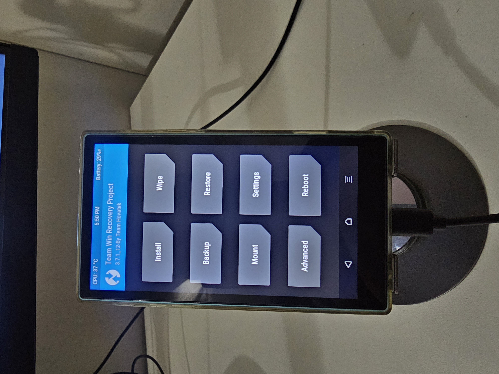

# TWRP for FiiO JM21

Custom recovery (TWRP) image for the FiiO JM21 digital audio player.

## Device

<table>
<tr>
<td valign="top" width="55%">

- **Model**: FiiO JM21
- **Manufacturer**: QUALCOMM
- **Brand**: qti
- **Platform**: Bengal (SoC codename `bengal_515`)
- **Hardware**: qcom
- **Vendor Android version**: 13

```
ro.product.vendor.model:        FiiO JM21
ro.product.vendor.manufacturer: QUALCOMM
ro.product.vendor.brand:        qti
ro.product.vendor.name:         bengal_515
ro.hardware:                    qcom
```

</td>
<td valign="top" width="45%" align="center">



<sub>TWRP 3.7.1_12 (Team Hovatek build) booted on a FiiO JM21 unit.</sub>

</td>
</tr>
</table>

## Files

| File | Description | SHA256 |
|---|---|---|
| `recovery-twrp.img` | TWRP 3.7.1_12 (Team Hovatek build) | `be83f7407750a48b034d2df71e8b2f1e827d69ad17af8770f10ac3bc1ed885bf` |
| `recovery-original.img` | Stock FiiO recovery | `020b2bbaf8bd7592cf4a0677628a05f5b9f16723eed2465fb00197e1b451bf13` |

The full official firmware package (which `recovery-original.img` was
extracted from) can be downloaded from the [FiiO forum](https://forum.fiio.com/note/showNoteContent.do?id=202412181641298410115&tid=17).

## Flashing

Device uses A/B slots with fastboot. Flash both slots.

```bash
adb reboot bootloader
fastboot flash recovery_a recovery-twrp.img
fastboot flash recovery_b recovery-twrp.img
fastboot reboot
```
